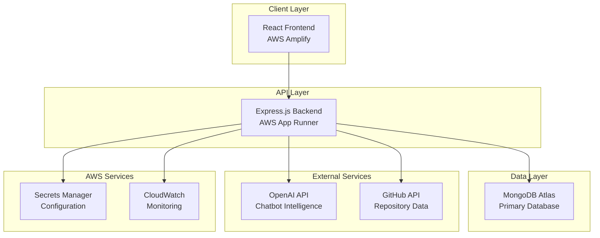
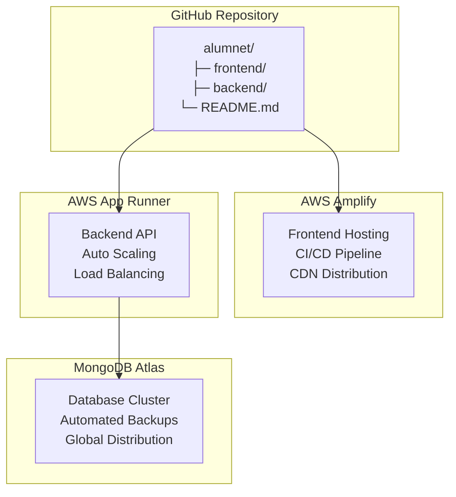

# Design Document

## Overview

ALUMNET is a full-stack alumni engagement platform built with modern web technologies and deployed on AWS infrastructure. The system follows a microservices-oriented architecture with a React frontend, Node.js/Express backend, and MongoDB Atlas database. The platform integrates with external services including OpenAI for AI chatbot functionality and GitHub API for alumni repository showcasing.

### Key Design Principles
- **Scalability**: AWS-native deployment with auto-scaling capabilities
- **Security**: JWT-based authentication, AWS Secrets Manager, and secure API design
- **Performance**: Optimized React components, efficient database queries, and CDN delivery
- **Maintainability**: Clean code architecture, proper separation of concerns, and comprehensive error handling
- **User Experience**: Responsive design, intuitive navigation, and real-time interactions

## Architecture

### High-Level Architecture



### Deployment Architecture



## Components and Interfaces

### Frontend Components

#### Core Layout Components
- **AppLayout**: Main application wrapper with navigation and routing
- **Navbar**: Responsive navigation with role-based menu items
- **Sidebar**: Collapsible sidebar for dashboard navigation
- **Footer**: Site footer with links and information

#### Authentication Components
- **LoginForm**: JWT-based login with role selection
- **RegisterForm**: User registration with student/alumni toggle
- **AuthGuard**: Route protection based on authentication status
- **RoleGuard**: Component access control based on user roles

#### Dashboard Components
- **StudentDashboard**: Job listings, events, alumni suggestions
- **AlumniDashboard**: Job posting, event creation, analytics
- **DashboardCard**: Reusable card component for dashboard items
- **QuickActions**: Common action buttons and shortcuts

#### Feature Components
- **JobBoard**: Job listing with filtering and search
- **JobCard**: Individual job posting display
- **JobForm**: Job creation and editing form
- **EventsList**: Event listings with registration options
- **EventCard**: Individual event display component
- **EventForm**: Event creation and management form

#### Community Components
- **ForumCategories**: Discussion category navigation
- **PostList**: Forum post listings with pagination
- **PostCard**: Individual post preview component
- **CommentThread**: Nested comment display and interaction
- **PostEditor**: Rich text editor for creating posts

#### AI and Integration Components
- **ChatbotInterface**: Conversational AI chat interface
- **AlumniSuggestions**: AI-powered networking recommendations
- **GitHubRepos**: Alumni repository showcase
- **ProfileCard**: User profile display component

### Backend API Structure

#### Authentication Routes (`/api/auth`)
- `POST /register` - User registration with role assignment
- `POST /login` - JWT token generation and authentication
- `POST /refresh` - Token refresh mechanism
- `POST /logout` - Session termination
- `GET /verify` - Token validation endpoint

#### User Management Routes (`/api/users`)
- `GET /:id` - User profile retrieval
- `PUT /:id` - Profile updates and modifications
- `POST /:id/github` - GitHub account linking
- `GET /:id/repos` - GitHub repository fetching
- `PUT /:id/privacy` - Privacy settings management

#### Job Management Routes (`/api/jobs`)
- `GET /` - Job listings with filtering and pagination
- `POST /` - Job creation (alumni only)
- `GET /:id` - Individual job details
- `PUT /:id` - Job updates (owner only)
- `DELETE /:id` - Job deletion (owner only)
- `POST /:id/apply` - Job application submission

#### Event Management Routes (`/api/events`)
- `GET /` - Event listings with filtering
- `POST /` - Event creation (alumni only)
- `GET /:id` - Event details and registration info
- `PUT /:id` - Event updates (owner only)
- `DELETE /:id` - Event deletion (owner only)
- `POST /:id/register` - Event registration
- `DELETE /:id/register` - Registration cancellation

#### Community Routes (`/api/community`)
- `GET /categories` - Forum category listings
- `GET /posts` - Post listings with pagination and filtering
- `POST /posts` - New post creation
- `GET /posts/:id` - Individual post with comments
- `PUT /posts/:id` - Post updates (author only)
- `DELETE /posts/:id` - Post deletion (author/admin only)
- `POST /posts/:id/comments` - Comment creation
- `PUT /comments/:id` - Comment updates (author only)
- `DELETE /comments/:id` - Comment deletion (author/admin only)

#### AI Integration Routes (`/api/chatbot`)
- `POST /chat` - Chatbot conversation endpoint
- `GET /suggestions` - AI-powered alumni suggestions
- `POST /analyze-profile` - Profile analysis for recommendations

## Data Models

### User Schema
```javascript
{
  _id: ObjectId,
  email: String (unique, required),
  password: String (hashed, required),
  role: String (enum: ['student', 'alumni'], required),
  profile: {
    firstName: String (required),
    lastName: String (required),
    avatar: String (URL),
    bio: String,
    location: String,
    phone: String,
    linkedIn: String,
    github: String,
    // Role-specific fields
    ...(role === 'student' ? {
      graduationYear: Number,
      major: String,
      university: String,
      interests: [String]
    } : {
      company: String,
      position: String,
      graduationYear: Number,
      major: String,
      university: String,
      expertise: [String],
      mentoring: Boolean
    })
  },
  privacy: {
    profileVisible: Boolean (default: true),
    contactVisible: Boolean (default: true),
    githubVisible: Boolean (default: true)
  },
  githubData: {
    username: String,
    repositories: [{
      name: String,
      description: String,
      url: String,
      language: String,
      stars: Number,
      lastUpdated: Date
    }],
    lastSync: Date
  },
  createdAt: Date,
  updatedAt: Date
}
```

### Job Schema
```javascript
{
  _id: ObjectId,
  title: String (required),
  company: String (required),
  description: String (required),
  requirements: [String],
  location: String,
  type: String (enum: ['full-time', 'part-time', 'internship', 'contract']),
  salary: {
    min: Number,
    max: Number,
    currency: String (default: 'USD')
  },
  skills: [String],
  postedBy: ObjectId (ref: 'User', required),
  applications: [{
    applicant: ObjectId (ref: 'User'),
    appliedAt: Date,
    status: String (enum: ['pending', 'reviewed', 'accepted', 'rejected'])
  }],
  isActive: Boolean (default: true),
  expiresAt: Date,
  createdAt: Date,
  updatedAt: Date
}
```

### Event Schema
```javascript
{
  _id: ObjectId,
  title: String (required),
  description: String (required),
  type: String (enum: ['networking', 'workshop', 'seminar', 'social']),
  date: Date (required),
  endDate: Date,
  location: {
    type: String (enum: ['online', 'offline', 'hybrid']),
    address: String,
    meetingLink: String
  },
  capacity: Number,
  organizer: ObjectId (ref: 'User', required),
  attendees: [{
    user: ObjectId (ref: 'User'),
    registeredAt: Date,
    status: String (enum: ['registered', 'attended', 'cancelled'])
  }],
  tags: [String],
  isPublic: Boolean (default: true),
  registrationDeadline: Date,
  createdAt: Date,
  updatedAt: Date
}
```

### Community Post Schema
```javascript
{
  _id: ObjectId,
  title: String (required),
  content: String (required),
  author: ObjectId (ref: 'User', required),
  category: String (enum: ['general', 'career', 'technical', 'networking']),
  tags: [String],
  comments: [{
    _id: ObjectId,
    author: ObjectId (ref: 'User'),
    content: String,
    createdAt: Date,
    updatedAt: Date,
    replies: [{
      author: ObjectId (ref: 'User'),
      content: String,
      createdAt: Date
    }]
  }],
  likes: [ObjectId] (ref: 'User'),
  views: Number (default: 0),
  isPinned: Boolean (default: false),
  isLocked: Boolean (default: false),
  createdAt: Date,
  updatedAt: Date
}
```

### Chat Session Schema
```javascript
{
  _id: ObjectId,
  user: ObjectId (ref: 'User', required),
  messages: [{
    role: String (enum: ['user', 'assistant']),
    content: String,
    timestamp: Date,
    metadata: {
      suggestedAlumni: [ObjectId] (ref: 'User'),
      actionTaken: String
    }
  }],
  context: {
    userProfile: Object,
    preferences: Object,
    lastActivity: Date
  },
  isActive: Boolean (default: true),
  createdAt: Date,
  updatedAt: Date
}
```

## Error Handling

### Frontend Error Handling
- **Global Error Boundary**: React error boundary for unhandled component errors
- **API Error Interceptor**: Axios interceptor for consistent API error handling
- **Form Validation**: Real-time validation with user-friendly error messages
- **Network Error Handling**: Offline detection and retry mechanisms
- **Authentication Errors**: Automatic token refresh and login redirects

### Backend Error Handling
- **Global Error Middleware**: Centralized error processing and logging
- **Validation Errors**: Mongoose validation with custom error messages
- **Authentication Errors**: JWT verification and role-based access errors
- **Database Errors**: MongoDB connection and operation error handling
- **External API Errors**: OpenAI and GitHub API error management
- **Rate Limiting**: Request throttling and abuse prevention

### Error Response Format
```javascript
{
  success: false,
  error: {
    code: 'ERROR_CODE',
    message: 'Human-readable error message',
    details: 'Additional error context',
    timestamp: '2025-01-09T10:30:00Z',
    requestId: 'unique-request-identifier'
  }
}
```

## Testing Strategy

### Frontend Testing
- **Unit Tests**: Jest and React Testing Library for component testing
- **Integration Tests**: API integration and user flow testing
- **E2E Tests**: Cypress for critical user journeys
- **Visual Regression**: Storybook and Chromatic for UI consistency
- **Accessibility Tests**: axe-core integration for WCAG compliance

### Backend Testing
- **Unit Tests**: Jest for individual function and middleware testing
- **Integration Tests**: Supertest for API endpoint testing
- **Database Tests**: MongoDB Memory Server for isolated database testing
- **Authentication Tests**: JWT token validation and role-based access testing
- **External API Tests**: Mock services for OpenAI and GitHub API testing

### Test Coverage Requirements
- **Minimum Coverage**: 80% code coverage for both frontend and backend
- **Critical Path Coverage**: 100% coverage for authentication and payment flows
- **API Contract Testing**: OpenAPI specification validation
- **Performance Testing**: Load testing for high-traffic scenarios

### Continuous Integration
- **GitHub Actions**: Automated testing on pull requests and merges
- **Quality Gates**: Code coverage and linting requirements
- **Security Scanning**: Dependency vulnerability checks
- **Deployment Testing**: Staging environment validation before production

## Security Considerations

### Authentication & Authorization
- **JWT Implementation**: Secure token generation with appropriate expiration
- **Password Security**: bcrypt hashing with salt rounds
- **Role-Based Access**: Middleware for endpoint protection
- **Session Management**: Secure token storage and refresh mechanisms

### Data Protection
- **Input Validation**: Comprehensive sanitization and validation
- **SQL Injection Prevention**: Mongoose ODM with parameterized queries
- **XSS Protection**: Content Security Policy and input sanitization
- **CORS Configuration**: Restricted origin policies for API access

### Infrastructure Security
- **AWS Secrets Manager**: Secure credential storage and rotation
- **HTTPS Enforcement**: SSL/TLS encryption for all communications
- **Environment Isolation**: Separate staging and production environments
- **Monitoring & Logging**: CloudWatch integration for security event tracking

### Privacy Compliance
- **Data Minimization**: Collect only necessary user information
- **User Consent**: Clear privacy policy and data usage agreements
- **Data Retention**: Automated cleanup of expired data
- **Right to Deletion**: User account and data removal capabilities